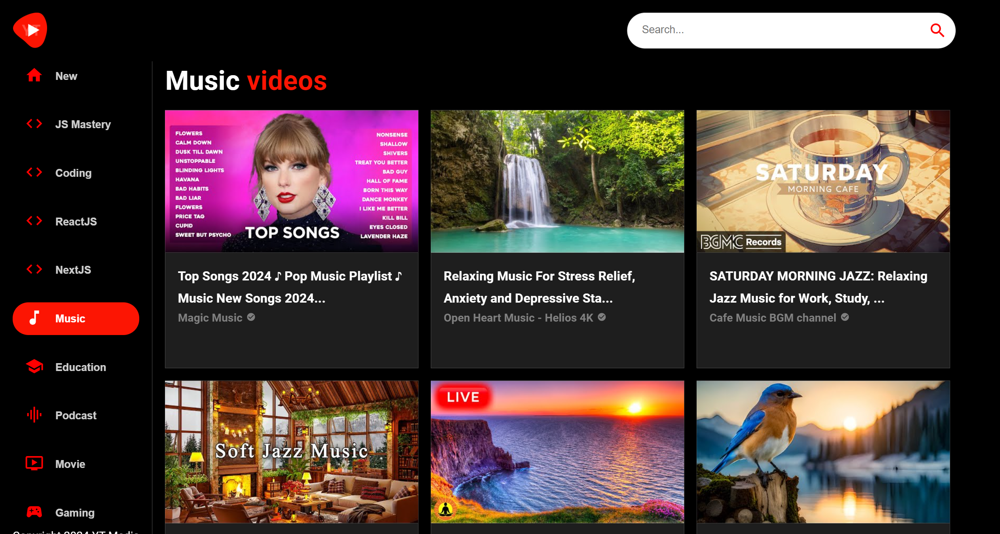

# YouTube Clone

## Overview

Welcome to the YouTube Clone project, a React-based application that replicates key features of the popular video-sharing platform.

## Features

- **Video Playback:** Watch videos seamlessly with React Player integration.
- **Navigation:** Explore different videos and categories using React Router.
- **Material-UI Integration:** Utilize Material-UI components for a sleek and responsive design.
- **API Requests:** Fetch video data from the YouTube Rapid API using Axios.

## Technologies Used

- React
- React Router DOM for navigation
- React Player for video playback
- Material-UI for styling and components
- Axios for making API requests

## Getting Started

1. Clone the repository: `git clone https://github.com/dezmanvee/youtube_clone.git`
2. Navigate to the project directory: `cd youtube_clone`
3. Install dependencies: `npm install`
4. Run the application: `npm start`

## Usage

1. Explore the application and navigate through videos and categories.
2. Enjoy watching videos with seamless playback.

## Acknowledgements

- This project is created using React and other open-source technologies.

## Project Thumbnail

